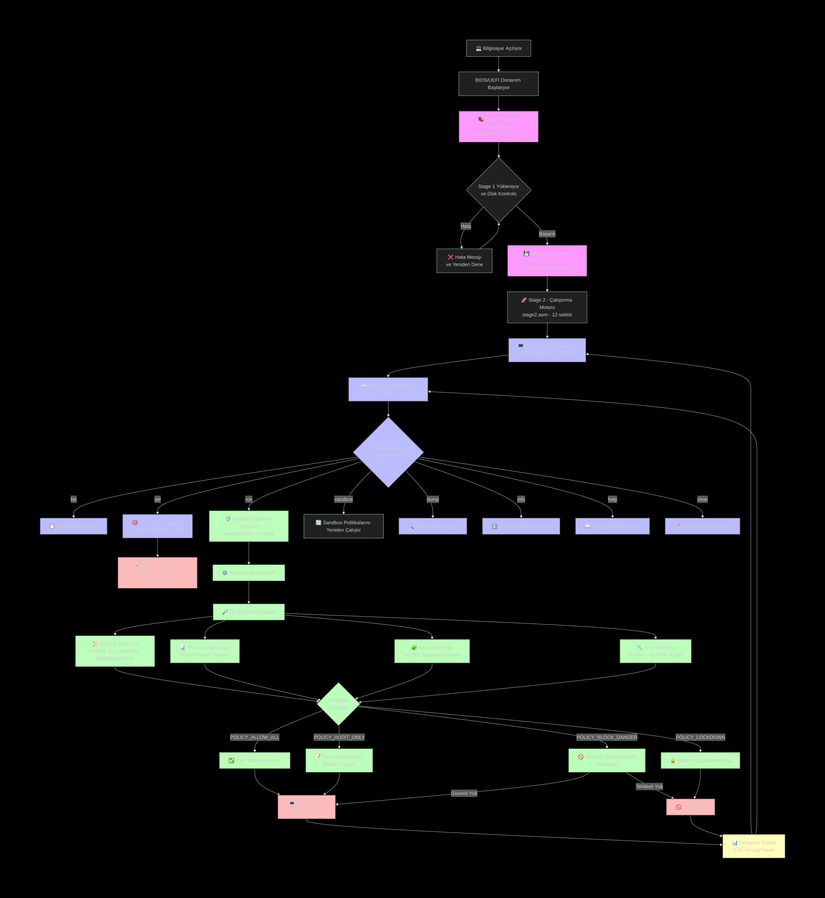

# 🔩 ironshell-x86 – Bare-Metal Shellcode Sandbox

**ironshell-x86** is a bare-metal x86 shellcode execution and analysis environment written entirely in 16-bit Assembly. It runs directly from a bootable disk image — no OS, no runtime, no libc. Just raw silicon.

[]()
[]()
[](LICENSE)
[]()

---

## ✨ Features

- 🥾 **2-Stage Bootloader** — Stage 1 MBR loads Stage 2 + Sandbox + Shellcode from disk with retry logic
- 🖥️ **TUI Shell** — Full interactive terminal UI with dual-panel VGA layout, command history, and live execution log
- 💉 **6 Injectable Payloads** — MSGBOX, MEMWALK, PORTPROBE, STACKSMASH, NXPROBE, CPUINFO
- 🛡️ **Sandbox Layer** — 4 enforcement policies, pre-execution opcode scanning, IVT snapshot diffing, register integrity checks
- 🔬 **Hardware Analysis** — CPUID vendor/brand/feature detection, A20 gate test, conventional memory sizing
- ⚙️ **Clean Build System** — NASM + QEMU Makefile with GDB debug stub, ndisasm disassembly, and binary size validation

---

## Schematic of the Working and Execution Logic 💻✅


---
## 📦 Installation

### 1. Clone the repository

```bash
git clone https://github.com/tc4dy/ironshell-x86.git
cd ironshell-x86
```

### 2. Install dependencies

```bash
sudo apt install nasm qemu-system-x86
```

### 3. Build and run

```bash
make
make run
```

---

## 🚀 Usage

```bash
make              # Build all binaries and assemble disk image
make run          # Launch in QEMU (terminal/curses mode)
make run-sdl      # Launch in QEMU (SDL window)
make debug        # Launch with GDB stub on port :1234
make disasm       # Disassemble all binaries via ndisasm
make clean        # Remove all build artifacts
make help         # Show full build reference
```

---

## 🖥️ Shell Commands

Once booted in QEMU, the interactive shell accepts:

| Command | Description |
|---|---|
| `list` | List all available payloads with index and risk flag |
| `sel <n>` | Select a payload by index number |
| `run` | Execute the currently selected payload |
| `sandbox` | Re-run all sandbox environment checks |
| `dump <hex>` | Hexdump 32 bytes at a given memory address |
| `info` | Display system memory layout and load addresses |
| `clear` | Clear the execution log panel |
| `help` | Show full command reference |

---

## 💉 Payload Reference

| # | Name | Description | Risk |
|---|---|---|---|
| 0 | `MSGBOX` | Constructs a PIC stub at 0xA000 and executes it | ✅ Safe |
| 1 | `MEMWALK` | Walks and dumps the BIOS Data Area (0x0400+) | ✅ Safe |
| 2 | `PORTPROBE` | Samples 8 I/O ports starting at 0x03F8 via `IN` | ✅ Safe |
| 3 | `STACKSMASH` | Writes canary pattern to stack and verifies integrity | ⚠️ Caution |
| 4 | `NXPROBE` | Tests NX/DEP enforcement by executing a RET stub | ✅ Safe |
| 5 | `CPUINFO` | Full CPUID enumeration — vendor, brand, stepping, SSE/AVX | ✅ Safe |

---

## 🛡️ Sandbox Policies

The sandbox module (`sandbox.asm`) loads at `0x9000` and enforces one of four active policies:

| Policy | Value | Behavior |
|---|---|---|
| `POLICY_ALLOW_ALL` | `0x00` | All payloads execute without restriction |
| `POLICY_BLOCK_DANGER` | `0x01` | Payloads flagged `DANGEROUS` are blocked *(default)* |
| `POLICY_AUDIT_ONLY` | `0x02` | All payloads execute; violations are logged only |
| `POLICY_LOCKDOWN` | `0x03` | No execution permitted under any condition |

Pre-execution analysis includes:

- **Opcode scanning** — detects `IN`/`OUT`, `CLI`, `WBINVD`, `RDMSR`/`WRMSR`
- **IVT diffing** — compares interrupt vector table before and after execution
- **Register integrity** — verifies `SS`, `DS`, and segment state post-execution
- **Bounds check** — confirms payload origin is within `0xA000–0xAFFF`

---

## 🗺️ Memory Layout

```
0x0000 – 0x03FF   Interrupt Vector Table (IVT)
0x0400 – 0x04FF   BIOS Data Area (BDA)
0x7C00 – 0x7DFF   loader.asm    Stage 1 MBR bootloader      (512 bytes)
0x7E00 – 0x8FFF   stage2.asm    Execution engine + TUI shell (12 sectors)
0x9000 – 0x9FFF   sandbox.asm   Protection & analysis layer  (8 sectors)
0xA000 – 0xAFFF   [EXEC]        Shellcode injection target
0xB800 – 0xBFFF   VGA Text Memory (80x25, mode 0x03)
```

---

## 🔧 Debug with GDB

```bash
make debug
```

Then in a second terminal:

```bash
gdb
(gdb) target remote :1234
(gdb) set architecture i8086
(gdb) break *0x7c00
(gdb) continue
```

Step through the MBR byte by byte, inspect registers, and trace the full boot sequence.

---

## ⚠️ Requirements

- `nasm` — Netwide Assembler
- `qemu-system-i386` — x86 system emulator
- `ndisasm` *(optional)* — for `make disasm`, included with NASM

---

## 📁 File Structure

```
ironshell-x86/
├── loader.asm      Stage 1 MBR — disk loader, VGA boot UI
├── stage2.asm      Execution engine, TUI shell, payloads
├── sandbox.asm     Protection layer, policy engine, IVT diffing
└── Makefile        Build, run, debug, disasm targets
```


